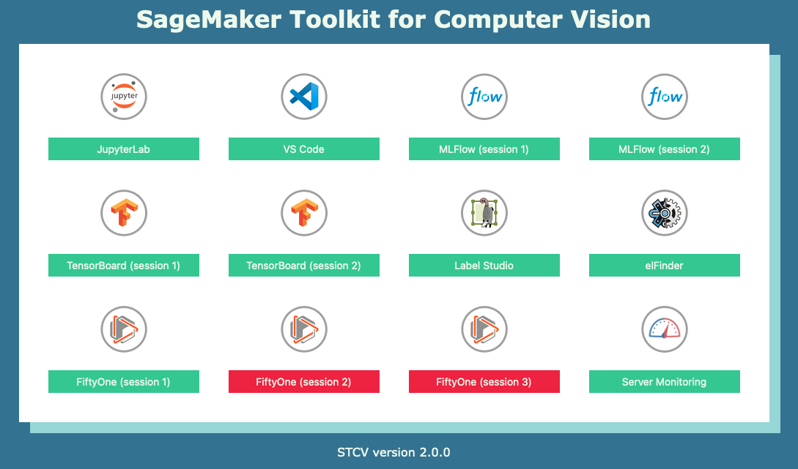
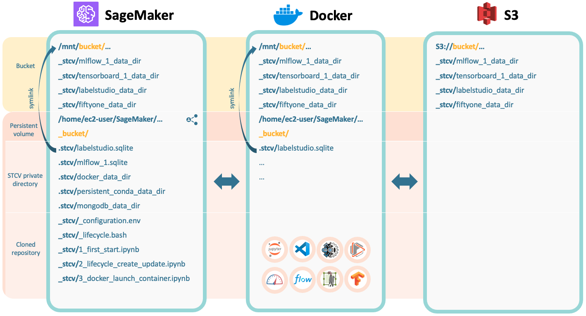

# SageMaker Toolkit for Computer Vision (STCV)




## Features

- Persistent conda environments
- S3 bucket mounting
- Dockerized
- Several tools accessible with just 1 click:
    - VS Code
    - Label Studio
    - FiftyOne
    - TensorBoard
    - MLFlow
    - elFinder
    - eZ Server Monitor


## Getting started

1. Clone STCV repository
```bash
git clone https://github.com/celpas/stcv.git /home/ec2-user/SageMaker/_stcv
```

2. Build Docker image using the notebook `1_first_start.ipynb`
3. Create/update lifecycle using the notebook `2_lifecycle_create_update.ipynb`
4. Launch container using the notebook `3_docker_launch_container.ipynb`
5. `https://<BASE_URL>/proxy/1123/`


## Structure




## Frequently Asked Questions

### How to use MLFLow?

1. Use the notebook `retrieve_instace_metadata.ipynb` to retrieve the ip address of your notebook instance
2. Use `http://<ip_address>:6004|6005` as tracking uri
